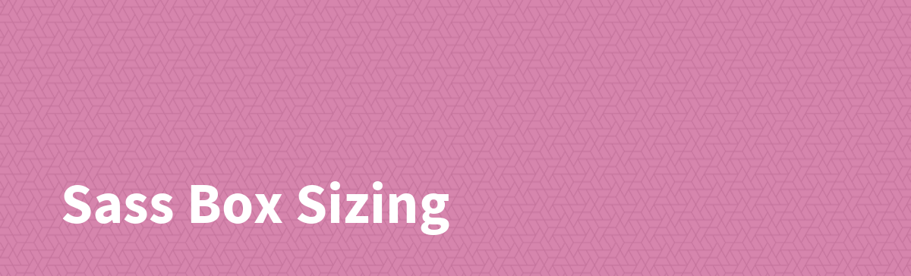

## Introduction

Generate global CSS box-sizing.

## Install

    npm install @sass-collective/sass-box-sizing --save

## Usage

### Module System

    @use "@sass-collective/sass-box-sizing"
    
    @include sass-box-sizing.box-sizing();
    
### Legacy @import

    @import "@sass-collective/sass-box-sizing"
    
    @include sass-box-sizing();
    
### CSS

    * {
        box-sizing: border-box;
    }
    
    *::before,
    *::after {
        box-sizing: inherit;
    }
    
## Options

* ``border`` _(default)_
* ``content``
